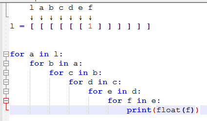

# Useful list of commands for Linux and Windows and Python packages and C++

Just a bunch of commands stacked together to easily find it.  
Some good tips and tricks [HERE](https://cmdlinetips.com/category/linux-tips/)

## Table of content

- [Useful list of commands for Linux and Windows and Python packages and C++](#useful-list-of-commands-for-linux-and-windows-and-python-packages-and-c)
  - [Table of content](#table-of-content)
  - [SSH related commands](#ssh-related-commands)
    - [Connect to a remote host](#connect-to-a-remote-host)
    - [Configuration file](#configuration-file)
    - [Send file to remote host](#send-file-to-remote-host)
    - [Receive a file from remote host](#receive-a-file-from-remote-host)
    - [ImageMagick](#imagemagick)
      - [Remove alpha channel](#remove-alpha-channel)
      - [Resize an image](#resize-an-image)
      - [Batch](#batch)
  - [Linux](#linux)
    - [TMUX](#tmux)
      - [Detach](#detach)
    - [Attach/new terminal](#attachnew-terminal)
    - [Re-attach last session](#re-attach-last-session)
    - [Extract file](#extract-file)
      - [Extract tar.gz](#extract-targz)
      - [Extract tar.xz](#extract-tarxz)
      - [Extract .zip](#extract-zip)
    - [Compress files](#compress-files)
      - [Zip files and folders](#zip-files-and-folders)
    - [Pandoc like a boss](#pandoc-like-a-boss)
    - [CentOS](#centos)
      - [Install steamcmd (and avoid errors)](#install-steamcmd-and-avoid-errors)
      - [Open ports](#open-ports)
        - [Open a specific port](#open-a-specific-port)
        - [List opened ports](#list-opened-ports)
  - [Windows](#windows)
    - [How to force a program to not run as Admin](#how-to-force-a-program-to-not-run-as-admin)
  - [Python](#python)
    - [Inserting the same value multiple times when formatting a string](#inserting-the-same-value-multiple-times-when-formatting-a-string)
    - [Read file lines:](#read-file-lines)
    - [Convert images to PDF](#convert-images-to-pdf)
    - [Lists](#lists)
      - [List comprehension](#list-comprehension)
      - [Extend a list](#extend-a-list)
      - [Index a list using a list](#index-a-list-using-a-list)
      - [Choose a random list from a list of lists](#choose-a-random-list-from-a-list-of-lists)
    - [Dictionaries](#dictionaries)
      - [Check if a key is in a dict](#check-if-a-key-is-in-a-dict)
    - [Tabulate](#tabulate)
    - [System related commands](#system-related-commands)
      - [List all immediate subdirectories](#list-all-immediate-subdirectories)
      - [List all subdirectories recursively](#list-all-subdirectories-recursively)
    - [Pandas](#pandas)
      - [Filter values](#filter-values)
      - [Select by [row, col] index](#select-by-row-col-index)
      - [Print interesting data](#print-interesting-data)
      - [Append a dataframe to another dataframe](#append-a-dataframe-to-another-dataframe)
    - [Format float](#format-float)
    - [JSON file operations](#json-file-operations)
      - [Save to JSON file](#save-to-json-file)
      - [Load from JSON file](#load-from-json-file)
      - [Append data to JSON](#append-data-to-json)
    - [Matplotlib](#matplotlib)
      - [Setting custom labels on the axis (xticks or yticks)](#setting-custom-labels-on-the-axis-xticks-or-yticks)
        - [Using subplots](#using-subplots)
        - [Without subplots](#without-subplots)
      - [Setting numbers on the axis (xticks or yticks)](#setting-numbers-on-the-axis-xticks-or-yticks)
      - [Linewidth](#linewidth)
      - [Remove top and right axis](#remove-top-and-right-axis)
      - [Change font size](#change-font-size)
      - [Legends](#legends)
      - [Colors](#colors)
        - [Color for each bar in a bar/histogram plot](#color-for-each-bar-in-a-barhistogram-plot)
      - [Remove X or Y ticks](#remove-x-or-y-ticks)
      - [Create a custom histogram](#create-a-custom-histogram)
    - [Date and time](#date-and-time)
      - [Get a list of months](#get-a-list-of-months)
    - [Psycopg2 and postgresql python module](#psycopg2-and-postgresql-python-module)
      - [Using the same variable multiple times in a SQL query](#using-the-same-variable-multiple-times-in-a-sql-query)
      - [Remove the quotes from a string for SQL query](#remove-the-quotes-from-a-string-for-sql-query)
  - [C++](#c)
    - [Iterators](#iterators)
      - [Get the iterator index](#get-the-iterator-index)
      - [Check if a value is inside a container](#check-if-a-value-is-inside-a-container)
    - [Nice way to write a for loop](#nice-way-to-write-a-for-loop)
  - [Spreadsheets](#spreadsheets)
    - [Google sheets](#google-sheets)
      - [How to merge two tables and sum its content](#how-to-merge-two-tables-and-sum-its-content)

## SSH related commands

Work for both windows and linux, if you have OpenSSH.

### Connect to a remote host

The most basic one. Be aware that `server_ip` can be a domain (e.g.: `example.org`) or an ip (e.g.: `192.168.69.42`).

```bash
ssh user_name@server_ip
```

If you use the fancy shit like a SSH public key authentication, use the `-i` argument and provide the path to the public key file (e.g.: `/home/user_name/.ssh/my_key.pub` or `~/.ssh/my_key.pub`), just remember that is not always that the key will have the `.pub` extension.

```bash
ssh -i path_to_public_key.pub user_name@server_ip
```

### Configuration file

You can setup a configuration file that have almost everything necessary to connect to a remote server, it is specially useful to use with vscode. [Here is the link for the full set of configurations](https://www.ssh.com/ssh/config/).

And here is a basic setup. Save as `config` in your `~/.ssh` folder.

```bash
Host a_name_for_this_setting
  HostName your_host_address_or_ip
  User your_username
  IdentityFile path_to_rsa_key_its_optional
```

### Send file to remote host

To send a file to a remote host using SSH. It is almost the same as the [connection](#connect-to-a-remote-host), but now you need to provide a valid path in the remote host, valid means that you have permissions and exists. `path_to_folder` can be, for example, `/home/user_name/Downloads`.

```bash
scp path_to/my_file.txt user_name@server_ip:path_to_folder
```

To send using a public key authentication is the same argument as the [connection](#connect-to-a-remote-host).

```bash
scp -i path_to/public_key.pub my_file.txt user_name@server_ip:path_to_folder
```

### Receive a file from remote host

To receive a file from the remote host is just the [send](#send-file-to-remote-host) but inversed.

```bash
scp user_name@server_ip:path_to/file.txt path_to_save/my_file.txt
```

The same is valid for the public key authentication.

```bash
scp -i path_to/public_key.pub user_name@server_ip:path_to/file.txt path_to_save/my_file.txt
```


### ImageMagick

#### Remove alpha channel

Of course the image extension can change.

```bash
magick convert img.jpg -background white -alpha remove -alpha off new_image.jpg
```

#### Resize an image

[More information about](http://www.imagemagick.org/Usage/resize/)

This will resize the image to 64x64. But in fact the images were only enlarged or reduced just enough so as to best fit into the given size.

```bash
magick convert dragon.gif -resize 64x64 resize_dragon.gif
```

This will resize the image to 64x64 ignoring the aspect ratio.

```bash
magick convert dragon.gif -resize 64x64\! resize_dragon.gif
```

This will resize in a percentage, keeping the aspect ratio.

```bash
magick convert dragon.gif -resize 50%  half_dragon.gif
```

#### Batch

Basically you use the operation that you want to do, but you use the command mogrify.

Remove alpha channel in a batch:

```bash
magick mogrify -path tmp/ -background white -alpha remove -alpha off *.jpg
```

The first command will resize all images from the current folder to 100x100 set the jpg quality to 60% and convert the `.png` images to `jpg` and then save to `tmp/`

The second will take all png files in your current directory, resize to 60% (of largest dimension and keep aspect ratio), set jpg quality to 60 and convert to jpg and then save to `tmp/`.

```bash
magick mogrify -path tmp/ -resize 100x100 -quality 60 -format jpg *.png

magick mogrify -path tmp/ -resize 60x60% -quality 60 -format jpg *.png
```

## Linux

Command lines for linux distributions.

### TMUX

[TMUX cheat sheet.](https://tmuxcheatsheet.com/)

#### Detach

Exit a window without quitting the terminal program.

`Ctrl` + `b` `d`

### Attach/new terminal

`Ctrl` + `b` `c`

### Re-attach last session

```bash
tmux a
```

### Extract file

This one is the most searched one (for me at least).

#### Extract tar.gz

You also can use this one [Extract tar.xz](#extract-tarxz).  

Extract (and create) to a folder called `file_name`.

```bash
tar -xvzf file_name.tar.gz
```

Extract to a custom folder.

```bash
tar -xvzf file_name.tar.gz -C my_foler
```

- `f`: this must be the last flag of the command, and the tar file must be immediately after. It tells tar the name and path of the compressed file.
- `z`: tells tar to decompress the archive using gzip
- `x`: tar can collect files or extract them. `x` does the latter.
- `v`: makes tar talk a lot. Verbose output shows you all the files being extracted.
- `C`: means change to directory `DIR`. In our example, `DIR` is `my_foler`.

#### Extract tar.xz

This one should work for [Extract tar.gz](#extract-targz)

```bash
tar xf archive.tar.xz
```

#### Extract .zip

The most simple one, but probably you need to install `unzip`. Don't worry usually it is pre-installed or in the package manager.

This will extract to a folder named `file_name`.

```bash
unzip file_name.zip
```

This will extract to a folder named `my_folder`.

```bash
unzip file_name.zip -d my_folder
```

### Compress files

Commands to compress files.

#### Zip files and folders

Probably you need to install `unzip`. Don't worry usually it is pre-installed or in the package manager.

To compress an entire folder and its subfolders. In this case it'll compress `my_folder` to `file_name.zip`.

```bash
zip -r file_name.zip my_folder
```

For a single file just do that, it'll zip `my_file.txt` to `file_name.zip`. Of course it work for any extension not only `.txt`.

```bash
zip file_name.zip my_file.txt
```

### Pandoc like a boss

Convert basically everything to PDF, merge pdf and all that good student shit.

### CentOS

Commands related with CentOS.

#### Install steamcmd (and avoid errors)

Install as described [here](https://developer.valvesoftware.com/wiki/SteamCMD#Manually).

Enable a repository:

```bash
dnf config-manager --set-enabled PowerTools
```

[More about on why there isn't the SDL2 packages](https://forums.centos.org/viewtopic.php?t=72010)  
Install the following packages:

```bash
yum -y install SDL
yum -y install SDL.i686
dnf install SDL2
dnf install SDL2.i686
```

Link this fucker:

```bash
mkdir ~/.steam/sdk32
ln -s Steam/linux32/steamclient.so ~/.steam/sdk32/
```

#### Open ports

[Website with solution](https://www.rootusers.com/how-to-open-a-port-in-centos-7-with-firewalld/)

##### Open a specific port

```bash
firewall-cmd --permanent --add-port=7812358712/tcp
```

```bash
firewall-cmd --reload
```

##### List opened ports

```bash
firewall-cmd --list-ports
```

## Windows

Windows related sttuff.

### How to force a program to not run as Admin

This is a way to force a program to run without administrator privileges or UAC.

```powershell
Windows Registry Editor Version 5.00

[HKEY_CLASSES_ROOT\*\shell\forcerunasinvoker]
@="Run without privilege elevation"

[HKEY_CLASSES_ROOT\*\shell\forcerunasinvoker\command]
@="cmd /min /C \"set __COMPAT_LAYER=RUNASINVOKER && start \"\" \"%1\"\""
```

Save this text in `name_of_file.reg` and add it to the Windows Registry. (Double-clicking on it should do the trick.)  
Afterwards, right-click the app you'd like to run without administrative privileges and select "Run without privilege elevation".  

## Python

Python related stuff.

### Inserting the same value multiple times when formatting a string

[Stack overflow](https://stackoverflow.com/a/1225656/10697552)

```python
incoming = 'arbit'
result = '{0} hello world {0} hello world {0}'.format(incoming)
```

```python
incoming = 'arbit'
result = '{st} hello world {st} hello world {st}'.format(st=incoming)
```

### Read file lines:

```python
with open(filename) as f:
  for line in f.readlines():
    print(line)

# or

for line in open(filename):
  print(line)
```

### Convert images to PDF

[Use img2pdf](https://pypi.org/project/img2pdf/).

```python
import img2pdf

img_list = ["a.png", "b.jpg", "x.jpg"]

with open("out.pdf", "wb") as f:
  f.write(img2pdf.convert(image_list))
```

### Lists

Some list related stuff.

#### List comprehension

[From this answer](https://stackoverflow.com/a/45079294/10697552). The best explanation possible.



#### Extend a list

A.k.a. append the items from a list to another list.

```python
x = [1, 2, 3]
x.extend([4, 5])

print (x)
```

Will result in:

```bash
[1, 2, 3, 4, 5]
```

#### Index a list using a list

You have a list of something and you want to index some elements from that list using a list.

```python
lst = ['a', 'b', 'c', 'd', 'e', 'f', 'g', 'h']
indexes = [0, 3, 7]
```

You can use numpy

```python
import numpy as np

lst = np.array(['a', 'b', 'c', 'd', 'e', 'f', 'g', 'h'])
indexes = [0, 3, 7]
result = lst[indexes]
```

Or list comprehension

```python
lst = ['a', 'b', 'c', 'd', 'e', 'f', 'g', 'h']
indexes = [0, 3, 7]

result = [lst[i] for i in indexes]
```

#### Choose a random list from a list of lists

Since `np.random.choice` can only choose from an 1-d array, [here's the solution](https://github.com/numpy/numpy/issues/10835#issuecomment-567233634).

```python
import numpy as np

rng = np.random.default_rng()
points = rng.random((10,2))

rng.choice(points)
```

### Dictionaries

#### Check if a key is in a dict

An efficient method. [As described here](https://stackoverflow.com/a/1602964/10697552)

```python
d = {"x": 1, "y": 2}

if "x" in d:
  return d["x"]
```

### Tabulate

Pretty useful to make tables in python print statements.

Example:

```python
import numpy as np
from tabulate import tabulate

a = np.random.uniform(0, 10, 1000)
b = np.random.normal(10, 5, 1000)

print(tabulate([["A", a.min(), a.max(), a.mean(), a.std()],
                ["B", b.min(), b.max(), b.mean(), b.std()]],
                headers=["-", "MIN", "MAX", "MEAN", "STD_DEV"]))
```

### System related commands

Commands that are related to the operating system, such as, list directories, files, create dir, remove, etc.

#### List all immediate subdirectories

[Link to the solution](https://stackoverflow.com/a/59938961/10697552)

```python
import os

subdirs = [f.path for f in os.scandir(parent_folder_path) if f.is_dir()]
```

#### List all subdirectories recursively

[Link to the solution](https://stackoverflow.com/a/973488/10697552)

```python
import os

subdirs = [f[0] for f in os.walk(directory)]
```

### Pandas

Commands for pandas dataframe

#### Filter values

Filtering a dataframe. [Here is a more complete guide](https://cmdlinetips.com/2018/02/how-to-subset-pandas-dataframe-based-on-values-of-a-column/), a.k.a. I stole some good shit from there.

About the function [contains](https://pandas.pydata.org/pandas-docs/stable/reference/api/pandas.Series.str.contains.html)

```python
import pandas as pd

def some_bool_expression(x):
  return x < 10

# using a function
df = df[some_bool_expression(df["foo"])]

# using a lambda expression
df = df[lambda x: df["foo"] < 10]

# just an expression
df = df[df["foo"] < 10]
df = df[df.foo < 10]

# Filtering out null values
df = df[df.foo.notnull()]

# filtering using list
df = df[df.foo.isin(["a", "b"])]

# if not in the list
df = df[~df.foo.isin(["a", "b"])]

# using expressions
df = df[df.foo.str.contains("regex")]
```

#### Select by [row, col] index

For more information [Here](https://thispointer.com/select-rows-columns-by-name-or-index-in-dataframe-using-loc-iloc-python-pandas/)

```python
dataFrame.loc[<ROWS RANGE> , <COLUMNS RANGE>]

# Select a single column by Index position
dfObj.iloc[ : , 2 ]

# Select multiple columns by Index range
dfObj.iloc[: , [0, 2]]

# Selecting a Single Column by Column Names
columnsData = dfObj.loc[ : , 'Age' ]

# Select only 2 columns from dataFrame and create a new subset DataFrame
columnsData = dfObj.loc[ : , ['Age', 'Name'] ]

# select single row
rowData = dfObj.loc[ 'b' , : ]

# Select multiple rows by Index labels
rowData = dfObj.loc[ ['c' , 'b'] , : ]
```

#### Print interesting data

Use [describe()](https://pandas.pydata.org/pandas-docs/stable/reference/api/pandas.DataFrame.describe.html) function.

```python
import pandas as pd

print(a.describe()[["foo", "bar"]].transpose()[["mean", "min", "max"]])
```

#### Append a dataframe to another dataframe

```python
import pandas as pd
a = pd.read_csv("some_file.csv")
b = pd.DataFrame(data=some_data)

# append returns a new dataframe
a = a.append(b)
```

### Format float

Below we have some samples of rounding a float number.

```python
a = 13.949999999999999

print("Value of a: {0:.4f}".format(a))

print("Value of a: %.2f" % a)

print("Value of a: %.4f" % round(a, 4))
```

### JSON file operations

#### Save to JSON file

Saving data to json file.

```python
import json

with open('data.json', 'w') as fp:
  json.dump(data, fp)
```

#### Load from JSON file

Load and read data from JSON file

```python
import json

with open('data.json', 'r') as fp:
    data = json.load(fp)
```

#### Append data to JSON

It'll depend on the data that you have inside the file, let's say that it is a list of dictionaries.

```python
# The data will look like this

data = [{
    "date": "2020-01-01",
    "message": "a message"
  }, {
    "date": "2019-12-31",
    "message": "hello"
  }]
```

```python
import json

with open('data.json', 'r+') as fp:
    data = json.load(fp)
    data.append({"date": "2018-11-15", "message": "append message"})
    json.dump(data, fp)
```

### Matplotlib

#### Setting custom labels on the axis (xticks or yticks)

##### Using subplots

```python
import matplotlib.pyplot as plt
import numpy as np

fig, ax = plt.subplots(1)

labels = ["a", "b", "c", "d", "e", "f", "g", "h", "i", "j"]

x = np.linspace(0, 10, num=10)
y = np.linspace(0,10, num=10)

ax.plot(x, y)

ax.set_xlim(min(x), max(x))
ax.set_ylim(min(y), max(y))

ax.set_xticks(range(len(labels)))
ax.set_yticks(range(len(labels)))

ax.set_xticklabels(labels)
ax.set_yticklabels(labels)

fig.show()
```

##### Without subplots

```python
import matplotlib.pyplot as plt
import numpy as np

labels = ["a", "b", "c", "d", "e", "f", "g", "h", "i", "j"]

x = np.linspace(0, 10, num=10)
y = np.linspace(0,10, num=10)

plt.plot(x, y)

plt.xlim(min(x), max(x))
plt.ylim(min(y), max(y))

plt.xticks(range(len(labels)), labels=labels)
plt.yticks(range(len(labels)), labels=labels)

plt.show()
```

#### Setting numbers on the axis (xticks or yticks)

How to set specific numbers on the X/Y axis, e.g.: 0.5 in 0.5 increments.  
[More info](https://stackoverflow.com/a/21394064/10697552)

```python
import matplotlib.pyplot as plt
import numpy as np
import math

def g(x):
  return math.sin(x)

fx = np.vectorize(g)

x = np.linspace(-5,5, 1000)
y = fx(x)

# evenly spaced by 1
plt.xticks(np.arange(x.min(), x.max() + 1, 1))

# spaced by 0.5
plt.yticks(np.arange(y.min(), y.max()+1, 0.5))

plt.plot(x, y)
plt.grid(axis='y', linestyle='-')
plt.show()
```

#### Linewidth

Set the linewidth

```python
import matplotlib.pyplot as plt
import numpy as np
import math

def f(x):
  return 1/(1+math.e**(-x))

fx = np.vectorize(f)
x = np.linspace(-5,5, 1000)
y = fx(x)

plt.plot(x, y, linewidth=4)
plt.show()
```

#### Remove top and right axis

To just leave the x and y axis.  
[Solution A](https://stackoverflow.com/a/27361819/10697552)  
[Documentation](https://matplotlib.org/examples/ticks_and_spines/spines_demo.html)  
[Solution B](https://stackoverflow.com/a/21754884/10697552)

```python
ax = plt.subplot(111)
ax.plot(x, y)

# Hide the right and top spines
ax.spines['right'].set_visible(False)
ax.spines['top'].set_visible(False)
```

```python
# Solution B
plt.gca().spines['right'].set_visible(False)
plt.gca().spines['top'].set_visible(False)
```

#### Change font size

Quick answer in the code, [longer version](https://stackoverflow.com/a/3900167/10697552)

```python
import matplotlib.pyplot as plt

SMALL_SIZE = 8
MEDIUM_SIZE = 10
BIGGER_SIZE = 12

plt.rc('font', size=SMALL_SIZE)          # controls default text sizes
plt.rc('axes', titlesize=SMALL_SIZE)     # fontsize of the axes title
plt.rc('axes', labelsize=MEDIUM_SIZE)    # fontsize of the x and y labels
plt.rc('xtick', labelsize=SMALL_SIZE)    # fontsize of the tick labels
plt.rc('ytick', labelsize=SMALL_SIZE)    # fontsize of the tick labels
plt.rc('legend', fontsize=SMALL_SIZE)    # legend fontsize
plt.rc('figure', titlesize=BIGGER_SIZE)  # fontsize of the figure title
```

#### Legends

Quick answer below, [docs](https://matplotlib.org/3.1.1/api/_as_gen/matplotlib.pyplot.legend.html)

```python
import matplotlib.pyplot as plt

plt.plot(x, y, label="inline label")

labels = ["a", "b", "c"] # must be the same size of the bars
bar_plt = plt.bar(x, y)
plt.legends(bar_plt, labels)
```

#### Colors

This one have a whole subset.

##### Color for each bar in a bar/histogram plot

You can set for each individually.

```python
import matplotlib.pyplot as plt

bar_plt = plt.bar(x, y)

bar_plt[0].set_color("r") # of course you can arrange a loop
```

You can use a color map, [list of color maps](https://matplotlib.org/tutorials/colors/colormaps.html).

[Stack overflow answer](https://stackoverflow.com/a/18903963/10697552)

If you are using a dictionary that have a counter.

```python
import matplotlib.pyplot as plt
import matplotlib.cm as cm
from matplotlib.colors import Normalize

d = {"a":10, "b":5, "c":19}

lst = [i for i in range(len(d))] # this will map the keys to a number

# option 1, if you choose a color map that has gradients
jet_map = cm.get_cmap('jet')
norm = Normalize(vmin=0, vmax=len(lst))
bar_plt = plt.bar(d.keys(), d.values(), color=jet_map(norm(lst)))

# option 2, if you choose a color map that is a qualitative
q_map = cm.get_cmap('tab10')
bar_plt = plt.bar(d.keys(), d.values(), color=q_map(lst))
```

#### Remove X or Y ticks

Quick answer below, [longer version](https://stackoverflow.com/a/12998531/10697552)

If you are using the subplots, [and also, here is the doc.](https://matplotlib.org/3.2.1/api/_as_gen/matplotlib.axes.Axes.tick_params.html)

```python
from matplotlib import pyplot as plt

plt.plot(range(10))
plt.tick_params(
    axis='x',          # changes apply to the x-axis
    which='both',      # both major and minor ticks are affected
    bottom=False,      # ticks along the bottom edge are off
    top=False,         # ticks along the top edge are off
    labelbottom=False) # labels along the bottom edge are off
```

#### Create a custom histogram

Sometimes you just want a histogram that have custom bins, for example the [NPS score board](https://www.netpromoter.com/know/).

```python
import matplotlib.pyplot as plt
import collections as col

df = pd.read_csv("./NPS.csv") # just to illustrate

hist = col.Counter()

# here go your "bin" width or logic for each value
for score in df["Scores"]:
  if sc <= 6:
    hist["Detractors"] += 1
  elif sc <= 8:
    hist["Neutral"] += 1
  elif sc <= 10:
    hist["Promoters"] += 1

# give a nice color if you want (there is a topic about colors around here)
bar_plt = plt.bar(hist.keys(), hist.values(), color=["g", "r", "y"])
plt.show()
```

### Date and time

#### Get a list of months

```python
import datetime

months = [(i, datetime.date(2008, i, 1).strftime("%B")) for i in range(1,13)]
```

### Psycopg2 and postgresql python module

Things about postgres (pg) and Psycopg2.

#### Using the same variable multiple times in a SQL query

From the [docs](http://initd.org/psycopg/docs/usage.html#passing-parameters-to-sql-queries)

```python
cur.execute(
    """INSERT INTO some_table (an_int, a_date, another_date, a_string)
        VALUES (%(int)s, %(date)s, %(date)s, %(str)s);""",
    {'int': 10, 'str': "O'Reilly", 'date': datetime.date(2005, 11, 18)})
```

So, for the same variable

```python
cur.execute(
    """INSERT INTO some_table (an_int, a_date, another_date, a_string)
        VALUES (%(name)s, %(name)s, %(name)s, %(name)s);""",
    {'name': "batata"})
```

#### Remove the quotes from a string for SQL query

[Stack overflow](https://stackoverflow.com/a/43879809/10697552) and merge with the solution at [Inserting the same value multiple times when formatting a string](#inserting-the-same-value-multiple-times-when-formatting-a-string)

```python
from psycopg2 import sql
...

cur.execute(sql.SQL('INSERT INTO {} VALUES(...)').format(sql.Identifier(database_name)))
```

#### Insert if value doesn't exists

Use [ON CONFLICT](https://www.postgresql.org/docs/9.5/sql-insert.html) clause.

```sql
INSERT INTO table (foo, bar) 
VALUES ('value for foo', 'value for bar')
ON CONFLICT (foo) do nothing
```

## C++

You know that this list will be gigantic when it just started as a "compilation of linux commands".

### Iterators

I'll just add this topic as a big one because there is a lot to remember here.

#### Get the iterator index

Accordingly to [this](https://stackoverflow.com/q/2152986/10697552), you have two options, consider `it` an iterator of `vec`.

```c++
int index = it - vec.begin();

int index = std::distance(vec.begin(), it);
```

#### Check if a value is inside a container

For `std::vector`:

```c++
auto found = std::find(vec.begin(), vec.end(), value);

if (found != vec.end())
  return true; // found (duh)
else
  return false; // not found (duh)
```

To check if a key is inside a `std::map`, you have 2 options:

```c++
if (my_map.count(key) > 0)
  return true;
```

Or maybe you want to save the iterator for later.

```c++
auto found = my_map.find(key);

if (found == my_map.end())
  return false; // not found

return true; // found, or do something else with found
```

### Nice way to write a for loop

Shortest and cool (I think) way to write a reverse `for loop`:

```c++
// consider something.size() the size of the array/vector/list/etc
for (auto i = something.size(); i-->0;)
  // do something
```

## Spreadsheets

Commands related to spreadsheets (google, excel or calc).

### Google sheets

About google sheets

#### How to merge two tables and sum its content

Quite useful if you have a scoreboard of somekind. [Link](https://infoinspired.com/google-docs/spreadsheet/merge-two-tables-in-google-sheets/).